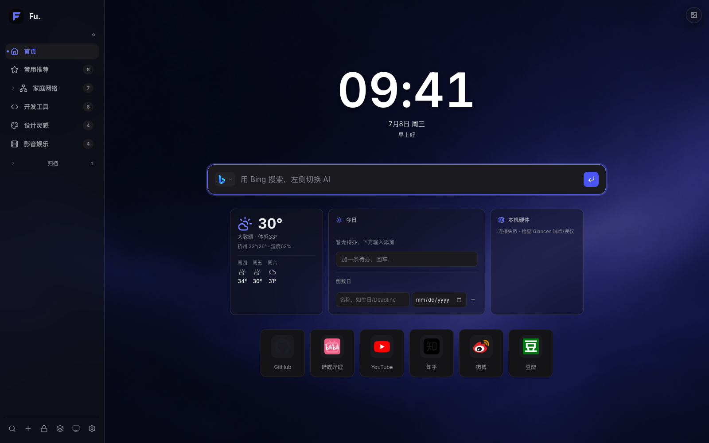
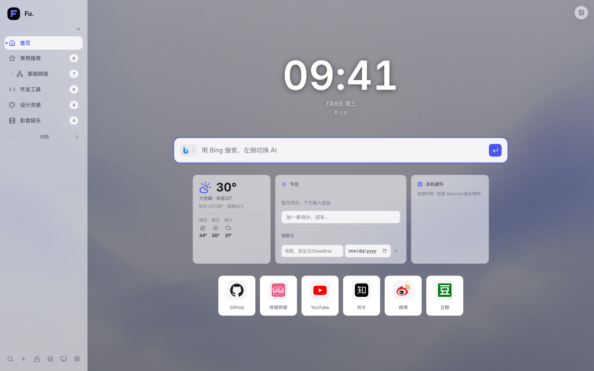
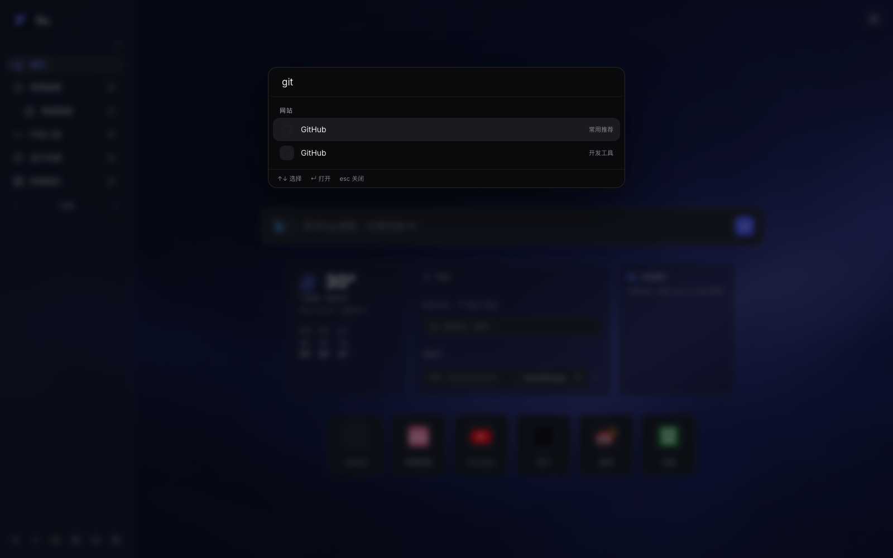
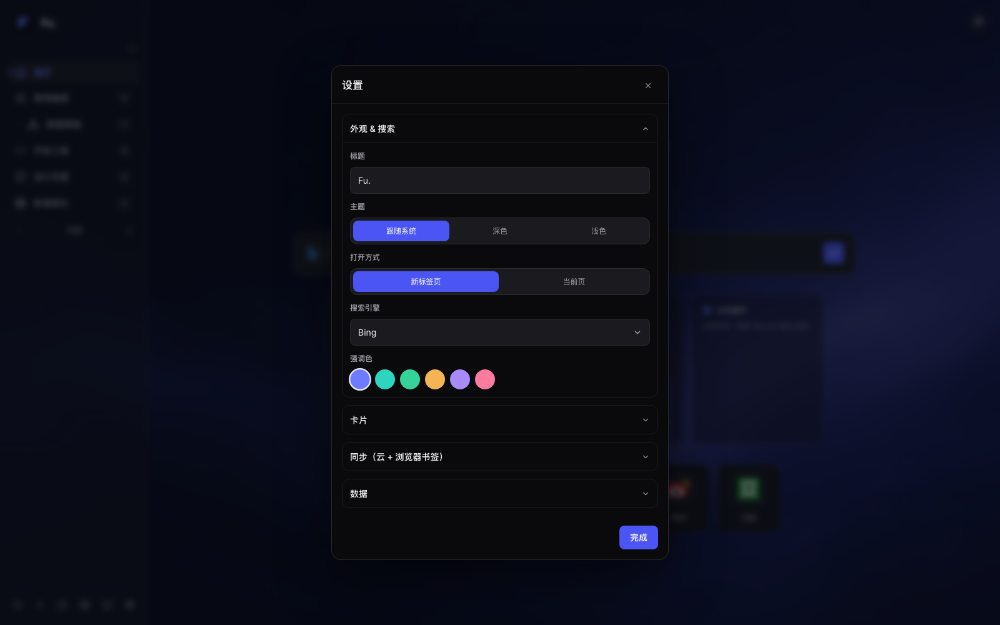

# Fu 导航 · Fu-Nav-Page

> 浏览器**新标签页导航**扩展（Chrome / Edge · Manifest V3）：把 homelab 服务与网页书签按**分组**管理，配置**随浏览器账号自动同步**到所有设备。

[](LICENSE)

| 深色首页 | 浅色首页 |
|---|---|
|  |  |
| **⌘K 命令面板** | **设置** |
|  |  |

---

## 💡 为什么是扩展，而非自托管

自托管导航（如 Homepage）通常部署在家里的 NAS / 服务器上，有两个天然痛点：人一旦离开家庭网络，导航页本身就打不开；要显示服务状态 widget，还得给每个服务逐一配 API key。

做成浏览器扩展 + `chrome.storage.sync` 之后：

- **随处可用**——导航页跟着浏览器走，任何网络下都能打开；
- **随处同步**——配置随浏览器账号自动同步到所有设备，无需自建同步服务；
- **零暴露面**——不需要把任何内网服务暴露到公网。

内网链接依然只有在内网才能打开（这一点任何方案都一样），但导航页与配置本身随处可用、随处可改。

---

## ✨ 功能

- **融合布局**：左侧分组侧边栏（Lucide 线性图标 + 计数，点击平滑跳转）、大屏 Hero（大时钟 + 问候 + 天气 + 大搜索框）、常用大卡 + 紧凑分组面板（信息密度借鉴 [gethomepage/homepage](https://github.com/gethomepage/homepage)）。
- **智能常用区**：锁定段 + 自动段两段式——右键卡片「锁定到常用」固定位置（带 pin 角标、可拖拽排序），其余按 **frecency**（点击次数 × 时间衰减）自动流动，最近常用的自己浮上来；网格规格可选 **6×2 / 8×2 / 6×3 / 8×3**（设置 → 常用）。
- **分组导航**（一等概念）：homelab 服务按设备/用途分组（NAS、软路由、虚拟化平台、网络设备…），网页书签按主题分组，统一在一个页面。
- **真实图标**：homelab 服务用 [dashboard-icons](https://github.com/homarr-labs/dashboard-icons) 品牌图标（DSM/Gitea/Plex/qBittorrent/AdGuard…），分组头用 [Lucide](https://lucide.dev) 线性图标，任意网站走 Google faviconV2（128px 高清）自动抓取，全部带字母色块兜底（编辑图标时还可手动搜 apple-touch-icon / icon.horse 候选）。
- **小组件**：大时钟 + 问候；天气（[open-meteo](https://open-meteo.com) 免 key + IP 定位，带缓存，点天气可切精确定位）。
- **多端同步**：`chrome.storage.sync` 切片存储（绕过 8KB/项限制）+ `local` 离线兜底 + 跨端实时刷新；改动立即落盘 + `savedAt` 时间戳择新，重载不丢。
- **工具栏收藏弹窗**：点扩展图标即弹出编辑框收藏当前页——网站名称 + 四模式图标（自动 / 纯色字母 / 在线候选 / 本地上传）+ 选分组；**已收藏的页面工具栏图标显示 ✓ 角标**，再点进入编辑/删除，确定后首页自动刷新。
- **一二级菜单（文件夹当子页面）**：分组是一级菜单，分组内的**文件夹是二级菜单**——侧栏展开文件夹子项，点击像切换页面一样在主区打开（带面包屑返回）；文件夹内可再建子文件夹（封顶两级）。搜索穿透所有层级；与浏览器书签**按任意层级递归双向同步**。
- **面板内打开（iframe）**：右键卡片「面板内打开」或在编辑里勾选，homelab 后台就地浮层打开不跳页，顶部带「新标签打开」兜底（个别服务禁止内嵌时用）。
- **背景壁纸**：内置多组 AI 生成主题壁纸（深浅色各配）+ **13 个在线壁纸源**（Bing 每日一图、[t.alcy.cc](https://t.alcy.cc/) 全部 11 个分类：二次元/萌版/AI/原神/风景/白底…、Picsum 摄影），支持**自定义图源 URL** 与**自动更新频率**（15 分钟 ~ 7 天 / 仅手动），也可本地上传。
- **删除撤销**：删网站/文件夹/分组/小组件后 5 秒内可一键撤销，原位恢复，不怕手滑。
- **新手引导**：首次使用自动进入 7 步引导，覆盖场景模式与设置内云同步/备份；设置 → 高级可随时重看。
- **内置图标库**：图标编辑「在线」里内置近百个（96 个）常用服务/homelab 图标，可搜索点选，免 favicon 抓取失败。
- **易操作**：右上/侧栏 `＋` 加站；卡片编辑（链接、名称、备注、图标、所属分组、是否首页常用）；编辑模式锁定/解锁；一键导入浏览器书签；导入/导出备份。
- **内网在线状态**：对 `192.168.1.x` 这类内网服务 best-effort 探测，装伴随服务（目前仅 macOS）后为真实在线状态。
- **搜索 + AI**：站内过滤 + 搜索引擎（Bing/Google/百度）与 AI（Kimi/ChatGPT/Claude/Perplexity/豆包/DeepSeek）在搜索框左侧一键切换，快捷键 `/` 聚焦；深/浅色主题。
- **内置演示配置**：首次安装即见完整示例（分组、文件夹、常用大卡、监控卡），可一键导入自己的浏览器书签后替换。

更多进阶能力——WebDAV 自托管云同步、浏览器书签双向同步、Infinity 备份导入、硬件监控卡、⌘K 命令面板、场景模式与归档、本机伴随服务（目前仅 macOS）——见下文「进阶功能」。

---

## 🚀 安装

### 方式 A：下载 Release 包（推荐）

1. 到本仓库 [Releases](../../releases) 页下载最新的 zip 包；
2. 解压到一个**固定目录**（加载后请勿移动或删除该目录）。

### 方式 B：git clone

```bash
git clone <本仓库地址>
```

### 之后（两种方式相同）

1. 浏览器地址栏打开 `chrome://extensions`（Edge 为 `edge://extensions`）；
2. 打开右上角的**开发者模式**开关；
3. 点击**加载已解压的扩展程序**，选择上面解压 / clone 出的目录；
4. 打开一个新标签页，即是 Fu 导航。

登录浏览器账号并开启同步后，在其它设备上装载同一扩展，分组与配置会自动多端同步。

### 🔄 更新到新版

开发者模式加载的扩展**不会自动更新**（浏览器只为商店安装的扩展提供自动更新），更新步骤按安装方式二选一：

- **git clone 安装**：目录里 `git pull`，然后到 `chrome://extensions` 点 Fu 导航卡片上的**刷新 ↻**，完成。
- **Release 包安装**：下载新版 zip，解压后**覆盖到原来的同一目录**，再到 `chrome://extensions` 点**刷新 ↻**。

> ⚠️ **不要删掉旧目录、换一个新目录重新加载**——「加载已解压」的扩展身份与目录路径绑定，换目录 = 浏览器视为全新扩展，你的收藏与设置不会跟过去。始终在同一目录里原地更新；你的数据存在浏览器里、**不在扩展目录里**，覆盖文件不会动到任何数据。稳妥起见，大版本更新前可先到 设置 → 同步与备份 导出一份备份。

---

## 🔍 权限说明

扩展要求的每一项权限如下，逐条如实——这是信任的基础，全部代码开源可对照审计。

### permissions

| 权限 | 用途 |
|---|---|
| `storage` | 保存你的分组/网站/设置（`sync` 多端同步 + `local` 兜底） |
| `bookmarks` | 仅用于「书签双向同步」功能，不开启该功能则不会读写书签 |
| `favicon` | 读取 Chrome 本地图标缓存为网站配图 |
| `activeTab` + `tabs` | 工具栏「收藏当前页」弹窗读取当前标签的标题/URL，并为已收藏页面显示 ✓ 角标 |
| `identity` | 仅用于可选的 Google Drive 云备份（需自己填 OAuth Client ID，不填不触发） |

### host_permissions

| 站点 | 用途 |
|---|---|
| `127.0.0.1:7842` | 可选的本机伴随服务（见下文，不装不请求） |
| `ipwho.is`、`get.geojs.io` | 天气定位（IP 粗定位） |
| `api.open-meteo.com` | 天气数据 |
| `www.googleapis.com` | Google Drive 云备份 |
| `www.bing.com`、`*.alcy.cc` | 在线壁纸源（Bing 每日一图 / 随机壁纸） |

### optional_host_permissions（`*://*/*`）

仅当你启用 **WebDAV 云同步**或**自定义硬件监控端点**时，按需弹窗授权对应站点，默认不请求任何站点。

---

## 🧩 进阶功能

### ☁️ WebDAV 自托管云同步

把整份配置存到**你自己的服务器**（NAS 的 WebDAV Server 套件 / Nextcloud / 任意 WebDAV）。设置里填地址（如 `https://nas.example.com:5006/fu-nav/`）+ WebDAV 账号密码，改动自动备份到云；其他设备在设置里一键**「从云恢复」**手动拉取最新——**不做后台自动覆盖**，本机改动永远优先、不会被云端旧数据冲掉。首次使用会弹窗申请该网址的访问授权。
**多备份**：手动「立即备份」每次生成独立的时间戳文件（`fu-nav-backup-YYYYMMDD-HHmmss.json`，自动保留最近 10 份），自动备份写固定文件；「从云恢复」列出全部历史备份（时间/大小）任选一份恢复——误操作也能回到任意历史时点。另支持 **Google Drive 云备份**（设置里填自己的 OAuth Client ID，数据存在你账号的应用专属文件夹，单文件）。

### 🔖 浏览器书签双向同步

导航的分组/网站与浏览器「书签栏 / Fu 导航」文件夹保持一致——导航里增删改写入该文件夹，浏览器里增删改也同步回导航（签名防回环，其它书签不动），支持任意层级的嵌套文件夹。设置里开「自动双向同步」，或手动导出/导入。

### 🌀 Infinity 备份导入

直接导入 Infinity New Tab 的 `.infinity` 备份：文件夹→分组、图标（联网 logo / 纯色字母）原样还原，按 URL 全局去重后并入。入口：设置 → 数据。

### 🖥 硬件监控卡（Glances 兼容）

对接 [Glances](https://github.com/nicolargo/glances) Web API（`glances -w`，默认端口 61208），零额外采集即可监控任意服务器的 CPU/内存/磁盘/温度，5s 刷新、阈值变色。新增卡片时填端点即可（如 `http://192.168.1.10:61208`）。

### 🔌 本机伴随服务（完全可选）

零依赖 Node 本机服务（目前仅 macOS），**只监听 `127.0.0.1`**，补齐扩展沙箱做不到的能力：内网服务真实在线探测、本机硬件监控（免装 Glances）、提醒事项/日历/AI 日报小组件。不安装不影响任何主功能，取不到数据时相关小组件自动隐藏。详见 [agent/README.md](agent/README.md)。

### ⌘K 命令面板

`⌘/Ctrl + K`（或 `/`）从任意页面唤出，搜**网站 / 分组 / 操作**，`↑↓` 选择、`↵` 打开或跳转，`Esc` 关闭——海量书签下最快的直达方式。

### 🗂 场景模式与归档

在侧栏底部的场景切换器进入「管理模式」，可新建学习、工作、生活等命名场景；一个分组可同时归属多个模式，并可为每个模式单独隐藏小组件或关闭首页常用区。低频分组可**归档**——归档后不再占据侧栏，在 设置 → 高级 → **归档管理** 集中查看/取消归档，⌘K 命令面板也能搜到归档分组（带「已归档」标注）直达，治书签膨胀。

---

## ❓ FAQ

**Q：配置能存多少条？会不会超出同步配额？**

`chrome.storage.sync` 有 8KB/项、100KB 总量的配额限制。Fu 导航已做切片存储，约可容纳数百至上千条网站；超出配额会自动转本机存储并提示，功能不受影响（只是该部分不再跨端同步）。

**Q：为什么不上 Chrome 商店？开发者模式加载安全吗？**

本项目仅代码开源、不上架商店。「加载已解压」的扩展与商店版运行机制完全相同，安全性取决于代码本身：本项目代码全部开源可审计，无任何远程代码，除上文权限表所列用途外无数据外发（详见下文「隐私」一节）。

**Q：伴随服务是什么？必须装吗？**

可选的本机 Node 服务（目前仅 macOS），仅监听 `127.0.0.1`，为扩展补齐内网探测、本机硬件监控、提醒/日历等能力。完全可选，不装不影响主功能。

**Q：如何从 Infinity New Tab 迁移？**

设置 → 数据 → 导入 `.infinity` 备份，分组、图标自动还原并去重。

---

## 🗂 结构

```
manifest.json          # MV3：newtab 覆盖 + 工具栏弹窗 + Service Worker；权限见上文权限表
newtab.html            # 新标签页外壳：加载内核与融合布局
background.js          # MV3 Service Worker：书签双向同步后台 + 已收藏 ✓ 角标（勿与 shared/background.js 混淆）
popup.{html,js,css}    # 工具栏「收藏当前页」弹窗
shared/
  core.js              # 内核：配置/持久化/编辑模态/搜索/命令面板/设置
  storage.js           # chunked sync + local 兜底 + 跨端变更（非扩展环境自动走 localStorage + 演示配置）
  icon-map.js          # 服务→dashboard-icons/Lucide 映射 + favicon 级联
  icons.js             # 图标装配（品牌→favicon→字母块）
  icon-editor.js       # 四模式图标编辑器
  weather.js           # open-meteo + IP 定位 + 缓存
  bmsync.js            # 浏览器书签双向同步
  cloud.js             # WebDAV / Google Drive 云备份
  hwmon.js             # 硬件监控（Glances 兼容格式）
  import-infinity.js   # Infinity 备份导入
  link-check.js        # 失效链接检测
  agent.js             # 本机伴随服务对接
  background.js / bg-presets.js / bg-storage.js / accent-presets.js   # 背景壁纸与主题强调色（此 background.js 是壁纸应用层，非 Service Worker）
  base.css             # 设计 token + 基础组件样式
layouts/
  fusion.{js,css}      # 融合布局：侧栏 + Hero + 分组面板
agent/                 # 可选本机伴随服务（见 agent/README.md）
data/seed.json         # 演示配置（首次安装看到的示例分组/网站）
icons/                 # 应用图标与内置壁纸
DESIGN.md              # 设计系统（token + 规范）
CLAUDE.md              # AI 协作开发的项目行为准则（本项目由人与 AI 结对开发）
```

## 🎨 设计系统（[DESIGN.md](DESIGN.md)）

视觉系统按 [google-labs-code/design.md](https://github.com/google-labs-code/design.md) 规范固化在根目录 [`DESIGN.md`](DESIGN.md)：YAML 设计 token（颜色/字体/圆角/间距/组件）+ 散文理念。近单色 + 单一靛蓝强调（Raycast/Arc 一脉），深浅双主题同语义，所有间距/圆角/字号取自 token，承载白字的强调填充用 `primary-strong` 过 WCAG AA。校验：

```bash
npx @google/design.md lint DESIGN.md   # 0 errors
```

## 🔗 参考项目

- [google-labs-code/design.md](https://github.com/google-labs-code/design.md)：设计系统以其格式固化为 `DESIGN.md`，token 可一键 lint / 导出 Tailwind。
- [gethomepage/homepage](https://github.com/gethomepage/homepage)：借鉴其「服务 + 书签统一分组面板」理念与信息密度。
- [Floccus](https://floccus.org)：WebDAV 自托管同步的思路来源。
- [homarr-labs/dashboard-icons](https://github.com/homarr-labs/dashboard-icons) / [Lucide](https://lucide.dev)：品牌图标与线性图标库。
- [eryajf/awesome-navigation](https://github.com/eryajf/awesome-navigation)：导航方案选型对比。
- 采用扩展而非自托管的原因见顶部「为什么是扩展」一节。

## 🔒 隐私

纯本地 + 浏览器账号同步，**没有自建服务器，你的数据不经任何第三方中转**（可选的 WebDAV / Google Drive 云备份除外——那是你自己指定的存储）。字体已本地自托管，**不向 Google Fonts 外链**。为如实起见，逐项列出会发生的外部请求：

- **每次打开新标签页**：品牌/线性图标从 `cdn.jsdelivr.net` 取（[dashboard-icons](https://github.com/homarr-labs/dashboard-icons) / [Lucide](https://lucide.dev)）；公网站点的 favicon 走 Google `t3.gstatic.com`（faviconV2），个别服务品牌图标可能取 `avatars.githubusercontent.com` 头像。
- **开启天气时**：`ipwho.is` / `get.geojs.io`（IP 粗定位）+ `api.open-meteo.com`（天气数据）。
- **选用在线壁纸源时**：`t.alcy.cc` / `picsum.photos` / `www.bing.com`（仅当前所选源）。
- **手动在图标编辑器里搜候选图标时**：目标站 `apple-touch-icon` + `t3.gstatic.com` + `icon.horse`。
- **配置了云同步时**：你自己的 WebDAV 地址，或 Google Drive（`googleapis.com`，需你自建 OAuth）。
- **主动用搜索/AI 时**：跳转到对应引擎（Bing/Google/百度）或 AI（Kimi/ChatGPT/Claude 等）——这是你点击发起的正常导航。

内网服务的图标走 Chrome 本地缓存不外发；伴随服务只监听 `127.0.0.1`。

## 📄 License

以 [MIT License](LICENSE) 开源。© 2026 JokerFu
